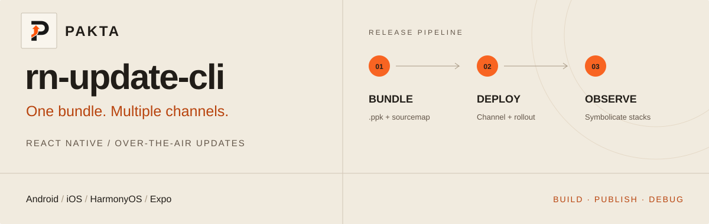

# rn-update-cli · React Native OTA Update CLI



[](https://www.npmjs.com/package/rn-update-cli)
[](./LICENSE)
[](#quick-start)

### One bundle. Multiple channels.

Build and publish **over-the-air (OTA) updates** for **React Native, Expo and HarmonyOS**. Native build registration, staged rollouts, CI/CD and sourcemap archiving from your terminal.

[简体中文](./README.zh-CN.md) · [Pakta](https://pakta.site/en/) · [Quick start](#quick-start) · [CLI guide](https://pakta.site/en/docs/cli/) · [SDK](https://github.com/pakta-team/rn-update#readme) · [Pricing](https://pakta.site/en/pricing/)

---

## From build to rollout.

| Capability | What you can do |
| --- | --- |
| **Cross-platform builds** | Register APK / AAB / IPA / HarmonyOS APP files and create `.ppk` updates |
| **Channel-based rollouts** | Deploy one artifact to multiple channels and native versions at independent percentages |
| **CI/CD automation** | Token authentication, non-interactive publishing, zero-write previews and exact deployment retries |
| **Hermes & diagnostics** | Reuse verified Hermes bases, archive sourcemaps and symbolicate error stacks |

## Quick start

Requires **Node.js ≥18.17**, your platform build toolchain and native integration of the [rn-update SDK](https://github.com/pakta-team/rn-update#readme). Run these commands from your React Native project root.

### 1. Install and select an app

Register and verify your email in the [Pakta dashboard](https://pakta.site), then:

```bash
npm install -g rn-update-cli
pakta login
pakta selectApp --platform android
```

Need an app? Run `pakta createApp --platform android --name MyApp` first. Select each platform separately; configuration is saved in `update.json`.

### 2. Register your distributed native build

```bash
pakta uploadApk ./app-release.apk
```

For other formats, use `uploadAab`, `uploadIpa` or `uploadApp`. The native build is the compatibility baseline for OTA updates.

### 3. Bundle and roll out to 10%

```bash
pakta bundle --platform android --output .pakta/output/android.ppk --no-interactive
pakta publish .pakta/output/android.ppk --platform android --name fix-001 --channel default --packageVersion 1.0.0 --rollout 10 --sourcemap .pakta/intermedia/android/index.bundlejs.map
```

Replace `default` and `1.0.0` with your registered channel and native version. Add `--expo` when bundling Expo apps. **Omitting `--rollout` defaults to 100%.**

<details>
<summary><strong>Publishing behavior and channel rules</strong></summary>

An explicit `--output` avoids guessing timestamped filenames. `bundle --name ...` also publishes; omit `--name` to build only.

Interactive publishing without targets asks whether to bind a native build after upload; declining only stores the artifact. Non-interactive publishing requires `--targets`, `--packageId` or `--packageVersion`.

Channels come from native metadata, defaulting to `default`. Upload `--channel` asserts identity without rewriting it. Standalone uploads/publishes create missing channels. A channel/native-version pair cannot have conflicting JS fingerprints; `buildTime` stays an opaque string.

</details>

## Multi-channel CI/CD

Create `targets.json`, with one independent deployment per entry:

```json
[
  { "channel": "default", "packageVersion": "1.0.0", "rollout": 10 },
  { "channel": "huawei", "packageVersion": "1.0.0", "rollout": 30 }
]
```

Set `RNU_SERVICE_URL` in CI and inject `PAKTA_API_TOKEN` from your secret store, using a personal token created in account settings. Validate the built artifact’s targets, then publish:

```bash
pakta publish .pakta/output/android.ppk --platform android --targets targets.json --dryRun --no-interactive
pakta publish .pakta/output/android.ppk --platform android --targets targets.json --name fix-001 --sourcemap .pakta/intermedia/android/index.bundlejs.map --no-interactive
```

`--dryRun` does not upload, create channels or write packages/deployments. A target’s `rollout` overrides the global value, falling back to 100%. Save the returned `packageId` and `deploymentIds` for exact retries:

```bash
pakta publish --deploymentIds DEPLOYMENT_ID_1,DEPLOYMENT_ID_2 --platform android --no-interactive
```

## Command reference

| Purpose | Commands |
| --- | --- |
| Account | `login`, `logout`, `me` |
| Apps | `createApp`, `apps`, `selectApp`, `deleteApp` |
| Channels | `channels`, `createChannel`, `updateChannel`, `deleteChannel` |
| Native builds | `uploadApk`, `uploadAab`, `uploadIpa`, `uploadApp`, `packages`, `deletePackage` |
| Inspect | `parseApk`, `parseAab`, `parseIpa`, `parseApp`, `extractApk` |
| OTA | `bundle`, `publish`, `versions`, `update`, `updateVersionInfo`, `deleteVersion` |
| Patches | `hdiff`, `hdiffFromApk`, `hdiffFromIpa`, `hdiffFromApp`, `registerPdiff` |
| Diagnostics | `symbolicate`, `cache`, `cache clean` |

Local `hdiff*` commands only generate patches; register exact native-build patches separately with `registerPdiff`. Full options: [cli.json](./cli.json).

## Advanced usage

<details>
<summary><strong>Hermes & sourcemaps</strong></summary>

`bundle` generates sourcemaps by default and composes the final Hermes map. Archive it with `publish --sourcemap`, then symbolicate:

```bash
pakta symbolicate stack.txt --platform android --hash UPDATE_HASH
```

The hash comes from the SDK’s `getUpdateMetadata().currentVersion`. Alternatively use `--versionId`, or `-` to read the stack from stdin.

Hermes defaults to `--hermesBase auto`; use `none` to disable it or pass a `.hbc/.ppk/.apk/.ipa` path. `--verifyHermesBase` checks readable disassembly and then raw HBC operands against complete binary strings, constants, function references and control-flow targets. Unknown or unreadable layouts fail closed and fall back to plain compilation; patch size depends on your build. The probe, verification and compiler/sourcemap subprocesses have bounded deadlines (30/120/300 seconds), configurable with `PAKTA_HERMES_PROBE_TIMEOUT_MS`, `PAKTA_HERMES_VERIFY_TIMEOUT_MS` and `PAKTA_HERMES_COMPILE_TIMEOUT_MS`. See [Hermes base verification](./docs/hermes-base-verification.md).

For Sentry, configure platform `sentry.properties`, use `@sentry/react-native/metro` for matching bundle/map Debug IDs, and use the `bundle` publishing flow for automatic uploads. Legacy Sentry accepts explicit `--sentry-release` and `--sentry-dist`, matching runtime values.

</details>

<details>
<summary><strong>Provider API</strong></summary>

Install a development dependency when importing the API in build scripts:

```bash
npm install --save-dev rn-update-cli
```

Configure service and authentication first. Place this in an async function or a module supporting top-level await:

```typescript
import { CLIProviderImpl } from 'rn-update-cli';

const provider = new CLIProviderImpl();
const bundle = await provider.bundle({
  platform: 'android',
  output: '.pakta/output/android.ppk',
  sourcemap: true,
});
if (!bundle.success) throw new Error(bundle.error);

const release = await provider.publish({
  filePath: '.pakta/output/android.ppk',
  sourcemap: '.pakta/intermedia/android/index.bundlejs.map',
  platform: 'android',
  name: 'fix-001',
  targets: 'targets.json',
});
if (!release.success) throw new Error(release.error);
```

Methods return `CommandResult`; check `success` before consuming `data`. Full interfaces: [src/types.ts](./src/types.ts).

</details>

<details>
<summary><strong>Connect your own service</strong></summary>

The default backend is `https://pakta.yoghourt.space`; the CLI appends `/admin/api/v1`. To use another deployment:

```bash
export RNU_SERVICE_URL=https://YOUR_HOST
```

PowerShell:

```powershell
$env:RNU_SERVICE_URL = 'https://YOUR_HOST'
```

Credentials are scoped by service URL.

</details>

<details>
<summary><strong>Environment variables and CLI automatic updates</strong></summary>

| Variable | Purpose |
| --- | --- |
| `RNU_SERVICE_URL` | Standalone service URL |
| `PAKTA_API_TOKEN` | Personal access token for CI |
| `NO_INTERACTIVE=true` | Disables prompts |
| `RNU_LANG` | `zh` (default) or `en` |
| `RNU_DEBUG=1` | Prints error stacks |
| `HTTPS_PROXY` / `HTTP_PROXY` / `NO_PROXY` | Proxies; lowercase names supported |
| `PAKTA_CACHE_DIR` | Hermes base cache directory |
| `PAKTA_HERMES_PROBE_TIMEOUT_MS` / `PAKTA_HERMES_VERIFY_TIMEOUT_MS` / `PAKTA_HERMES_COMPILE_TIMEOUT_MS` | Hermes probe, equivalence verification and compiler/sourcemap deadlines in milliseconds |
| `RNU_AUTO_UPDATE=0` | Disables background updates |

Global installations can update in the background after a successful command, retaining their package manager, registry, authentication, proxy and global prefix. CI, local dependencies and npx installs are not modified. Alternatively set `RNU_DISABLE_AUTO_UPDATE=1`, or select npm, pnpm, yarn or bun with `RNU_AUTO_UPDATE_PACKAGE_MANAGER`.

</details>

---

[MIT](./LICENSE) · Copyright (c) 2026 Yoghourt Technology(BeiJing) Company Limited.
